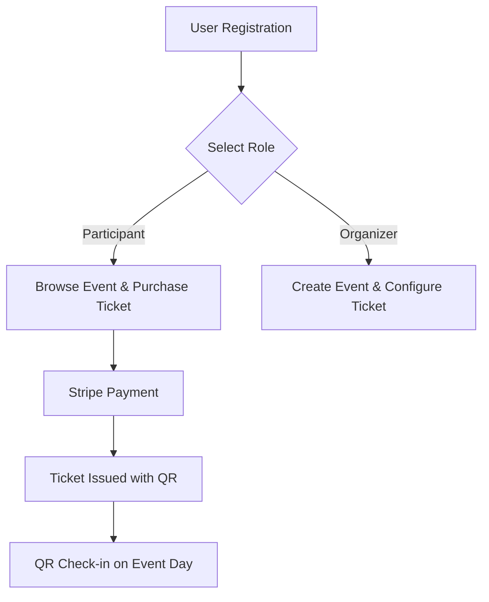

# 🚀 EventHub

**EventHub** is a modern full-stack platform that enables complete management of events—from event creation, ticket configuration, online payment, to QR-based attendee check-in.

The platform supports **two user roles**:  
🔹 **Organizer** – can create and manage events and tickets  
🔹 **Participant** – can purchase event tickets and attend using QR validation

With a scalable modular architecture, EventHub is designed as an **Event Ticketing & Management Platform** with potential to evolve into an **Event Marketplace**.

## ✨ Key Features

### 🔹 Role-based Features

| Feature                            | Participant | Organizer            |
| ---------------------------------- | ----------- | -------------------- |
| User registration & role selection | ✔           | ✔                    |
| Profile management                 | ✔           | ✔                    |
| Purchase event ticket              | ✔           | ✔ (for other events) |
| Create & manage events             | ❌          | ✔                    |
| Create & manage ticket types       | ❌          | ✔                    |
| View ticket sales analytics        | ❌          | ✔                    |
| QR-based check-in                  | Provides QR | Scans QR             |

---

### 🎟️ Ticketing & Payment

- Integration with **Stripe PaymentIntent**
- Supports multiple ticket types
- Automatic QR code ticket generation
- Live payment status updates via Stripe Webhook

---

### 📊 Organizer Dashboard

- Total events
- Ticket sales performance
- Recent registrations
- Pending approvals
- Feedback received

---

## 🏛️ Architecture

| Layer          | Technology                  |
| -------------- | --------------------------- |
| Frontend       | Vue.js 3, TypeScript, Pinia |
| Backend        | Go (Gin, GORM with UUID)    |
| Database       | PostgreSQL                  |
| Payment        | Stripe                      |
| Authentication | JWT                         |
| ORM            | Gorm                        |
| Cache          | Redis                       |

---

## 🔄 Business Workflow



---

## 🚀 Setup & Installation

### ⚠️ Required

- Redis
- Docker
- Stripe & Stripe CLI

### 1️⃣ Clone the repository

```bash
git clone https://github.com/<username>/EventHub.git
cd EventHub
```

### 2️⃣ Backend Setup

```bash
cd backend
go mod tidy
go run main.go
```

### 3️⃣ Frontend Setup

```bash
cd backend
go mod tidy
go run main.go
```

---

## 🔐 Environment Variables

- Backend .env

```bash
# Server Configuration
PORT=8080
APP_ENV=development

# Database Configuration (Docker)
DB_HOST=postgres
DB_PORT=5432
DB_USER=db_user
DB_PASSWORD=db_password
DB_NAME=db_name
DB_SSLMODE=disable

# Postgres Config (Docker)
POSTGRES_USER=postgres_user
POSTGRES_PASSWORD=postgres_password
POSTGRES_DB=postgres_db

# pgAdmin
PGADMIN_DEFAULT_EMAIL=
PGADMIN_DEFAULT_PASSWORD=
PGADMIN_PORT=5050

# Database Configuration (Local Development)
# DB_HOST=localhost
# DB_PORT=5432
# DB_USER=db_user
# DB_PASSWORD=db_password
# DB_NAME=db_name
# DB_SSLMODE=disable

# Redis Configuration (Docker)
REDIS_HOST=redis
REDIS_PORT=6379
REDIS_PASSWORD=
REDIS_DB=0

# Redis Configuration (Local Development)
# REDIS_ADDR=localhost:6379

# JWT Configuration
JWT_SECRET=your_jwt_secret
JWT_EXPIRATION=24h
REFRESH_TOKEN_EXPIRATION=168h

# CORS Configuration
CORS_ALLOWED_ORIGINS=http://localhost:5173,https://eventhub.com,https://eventhub.staging.com

# File Upload Configuration
UPLOAD_PATH=./uploads
MAX_UPLOAD_SIZE=10485760
ALLOWED_FILE_TYPES=image/jpeg,image/png,image/jpg

# Payment Gateway Configuration
STRIPE_SECRET_KEY=sk_test_...
STRIPE_WEBHOOK_SECRET=whsec_...

# Email Configuration (Optional)
SMTP_HOST=smtp.gmail.com
SMTP_PORT=587
SMTP_USER=your-email@gmail.com
SMTP_PASSWORD=your-app-password
EMAIL_FROM=noreply@eventhub.com

# Application URLs
FRONTEND_URL=http://localhost:5173
BACKEND_URL=http://localhost:8080

# Logging
LOG_LEVEL=info
LOG_FORMAT=json
```

- Frontend .env

```bash
VITE_API_BASE_URL=http://localhost:8000/api/v1
VITE_STRIPE_PUBLISHABLE_KEY=pk_test_...
```

---

## 💳 Stripe Webhook Setup

```bash
stripe listen --forward-to localhost:8080/api/payments/webhook
```

Output:

```bash
Your webhook signing secret is whsec_xxxxxxxxxxx
```

Add the value to .env (backend).

---

## 🧪 Payment API Testing

URL

```bash
POST http://localhost:8080/api/payments
```

Headers

```bash
Authorization: Bearer <JWT_TOKEN>
Content-Type: application/json
```

Body

```bash
{
  "ticket_id": "11111111-2222-3333-4444-555555555555",
  "quantity": 1
}
```

---

## 🧑‍🎨 Author

**EventHub Project**

Developed by **Eef Mekelliano**

```
Software Engineer
```

📬 Contact: eefmekel@gmail.com

⭐ GitHub: https://github.com/Eef-M

🌍 Portfolio: https://eef-mekelliano.vercel.app/

---

# 🎉 Thank you for checking out EventHub!
